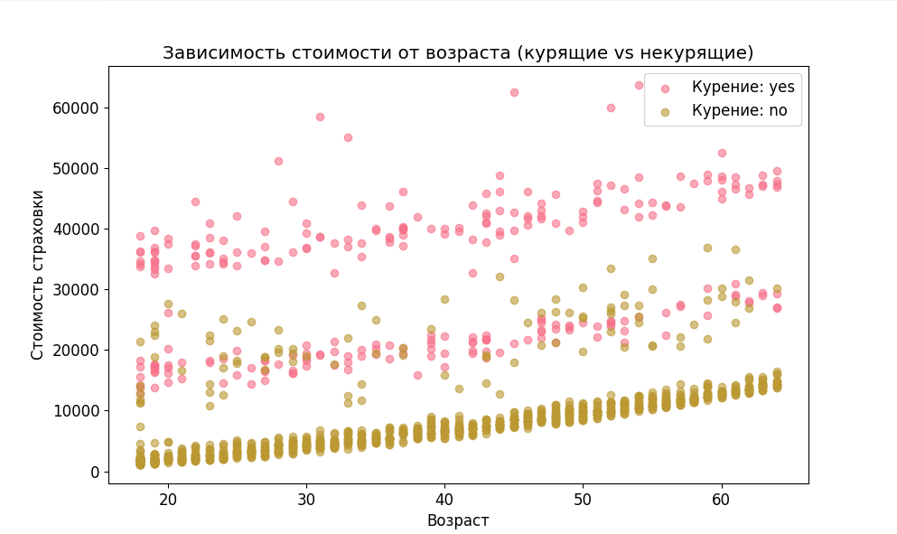
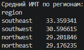
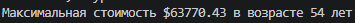
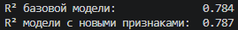

# Лабораторная работа 1. Линейная регрессия
## Часть 2. Задача 1 - Анализ данных медицинского страхования
### Цель задачи
Построить модель линейной регрессии, которая сможет предсказать стоимость медицинской страховки на основе характеристик клиента.
### Задание 1. Дополнительный анализ
#### 1.1. График зависимости стоимости страховки от возраста отдельно для курящих и некурящих

#### 1.2. Средний ИМТ для каждого региона

#### 1.3. Возраст, для которого стоимость страховки максимальная

### Задание 2. Улучшение модели
#### 2.1 - 2.3. Признаки age_group, high_bmi и сравнение R^2
```python
df_v2 = df.copy()
bins = [17, 30, 50, 100]
labels = ['young', 'middle', 'senior']
df_v2['age_group'] = pd.cut(df_v2['age'], bins=bins, labels=labels)
df_v2['high_bmi'] = (df_v2['bmi'] > 30).astype(int)

df_v2 = pd.concat([df_v2, pd.get_dummies(df_v2['age_group'], prefix='age', drop_first=True)], axis=1)
df_v2['smoker_enc'] = LabelEncoder().fit_transform(df_v2['smoker'])
df_v2['sex_enc'] = LabelEncoder().fit_transform(df_v2['sex'])
df_v2 = pd.concat([df_v2, pd.get_dummies(df_v2['region'], prefix='region', drop_first=True)], axis=1)

X2 = df_v2.drop(['charges', 'smoker', 'sex', 'region', 'age_group'], axis=1)
X2_train, X2_test, y2_train, y2_test = train_test_split(X2, y, test_size=0.2, random_state=42)
model_v2 = LinearRegression().fit(X2_train, y2_train)
r2_v2 = r2_score(y2_test, model_v2.predict(X2_test))

print(f"R² базовой модели:              {r2:.3f}")
print(f"R² модели с новыми признаками:  {r2_v2:.3f}")
```


### Задание 3. Интерпретация
#### 3.1. Почему курение так сильно влияет на стоимость страховки
Курение - сильнейший фактор риска развития тяжелых хронических онкологоических, сердечно-сосудистых, респиартоных заболеваний.
#### 3.2. 3 способа улучшения модели
- Добавить полиномиальные признаки
- Добавить взаимодействия признаков
- Использовать нелинейные модели
#### 3.3. Дополнительные данные для лучшего предсказания
1. Профессиональная деятельность и условия труда
2. Генетическая история
3. Уровень физической активности и показатели сна


## Часть 3. Задача 2 - Предсказание цен на недвижимость 
### Цель задачи
Построить продвинутую модель регрессии для предсказания цены дома, используя: - Обработку пропущенных значений - Продвинутый Feature Engineering - Сравнение различных типов регрессий (Ridge, Lasso) - Подбор гиперпараметров
### Задание 1. Дополнительный Feature Engineering
### Задание 2. Улучшение обработки пропусков
### Задание 3. Анализ остатков
### Задание 4. Кросс-валидация
